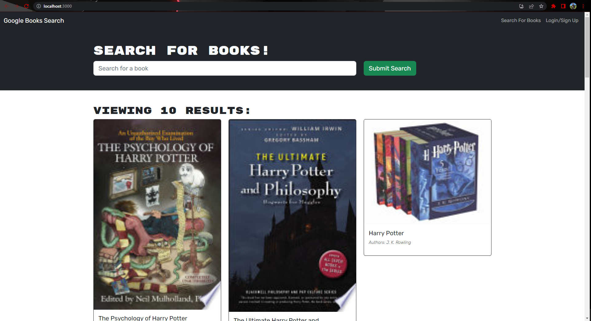

# book-search

## Description 
This is a web application where you can search for your favorite books and save them to you profile. So you can keep track of your favorite books

## License 

## Table of Contents
- [Installation](#installation)
- [Usage](#usage)
- [License](#license)
- [Contribute](#how-to-contribute)
- [Test](#test)
- [Apps Used](#applications-used)
- [Link](#live-link)

## Installation 
npm i

## Usage 
clone the repo over to your local machine 

## How to Contribute 
You don't need to contribute to this project 

## Test
npm run test

## Applications Used
MongooseDB, Apollo client and server, React, Nodejs

## Live Link
https://dry-brook-58734.herokuapp.com/

## Screenshot

## Questions
If you have any questing please contact me at jacobzea96@gmail.com, and you can find more of my work at https://github.com/JacobZ96. 
